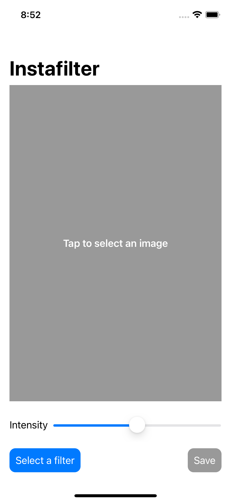
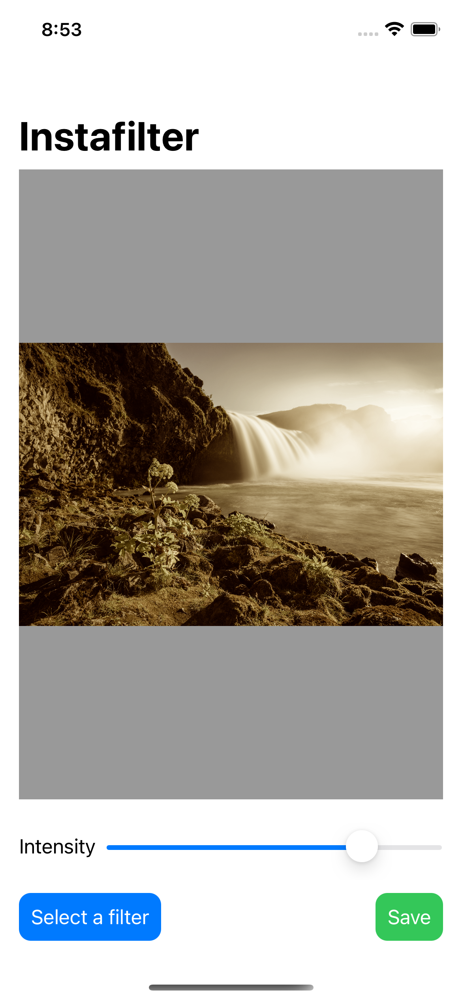
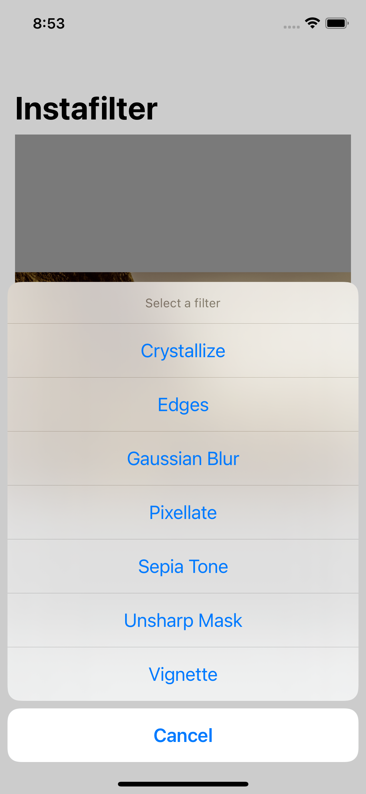
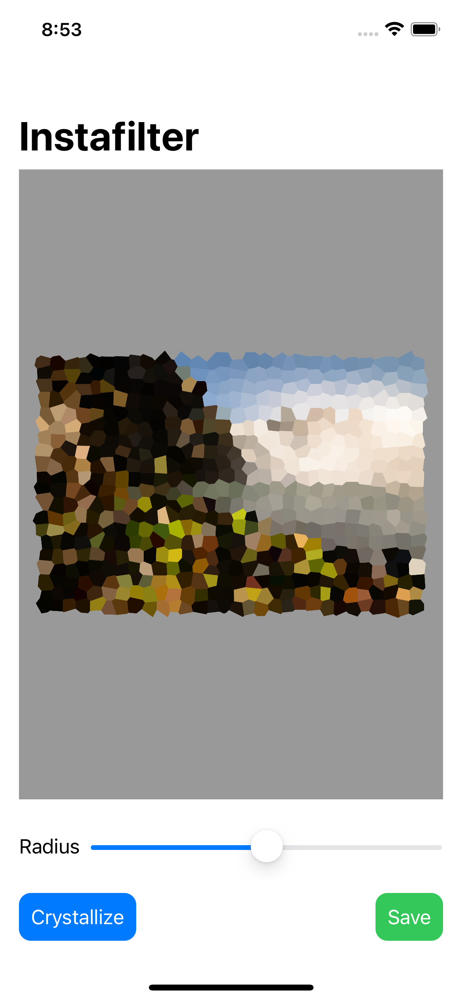
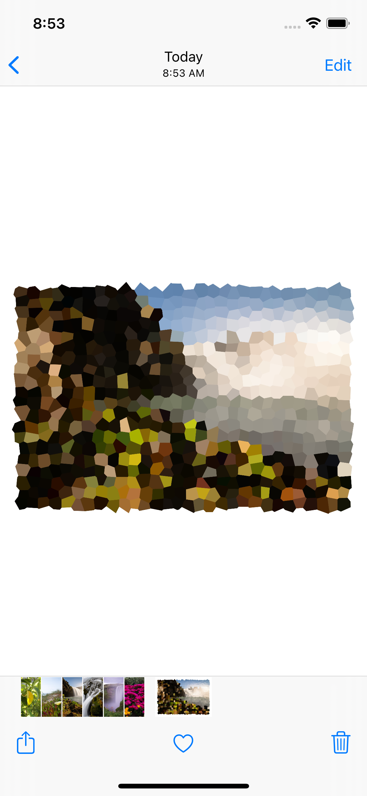

# Instafilter
Instafilter is 13th project of 100 Days of SwiftUI by Paul Hudson. This apps is so cool! It allows the user choose a picture from their library, apply filters to it and then save it back to the library. 

    
